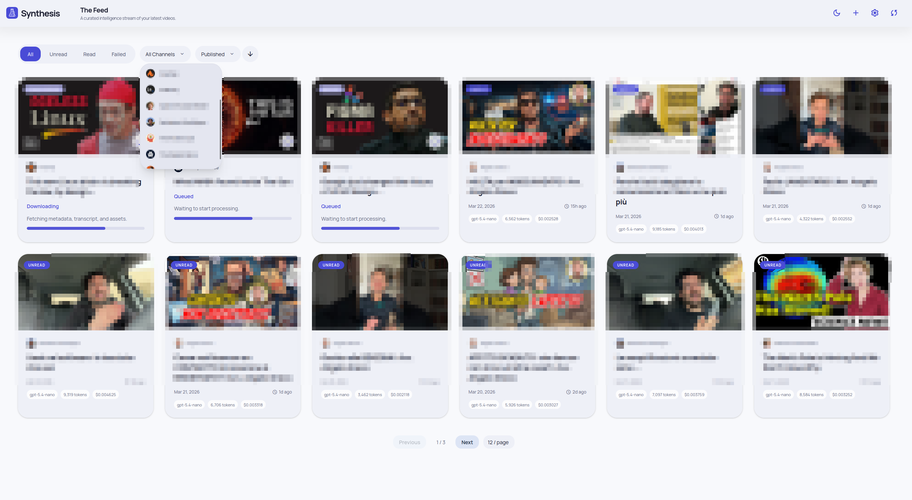
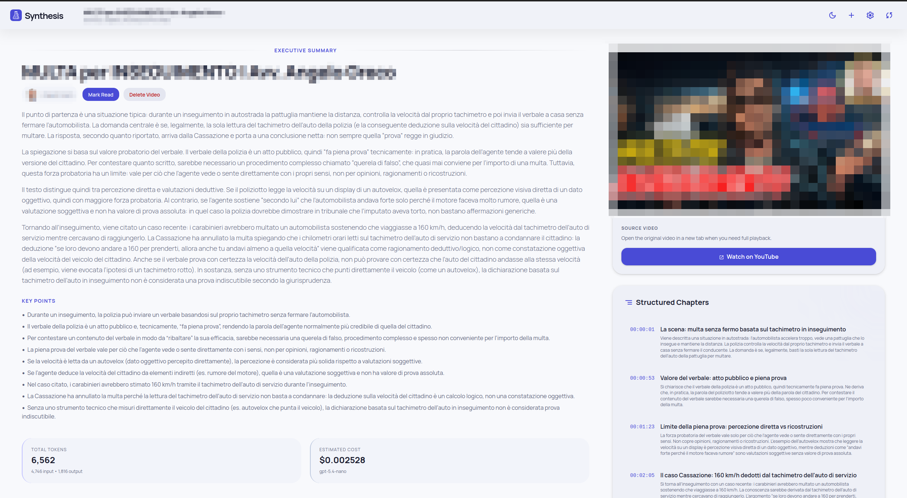
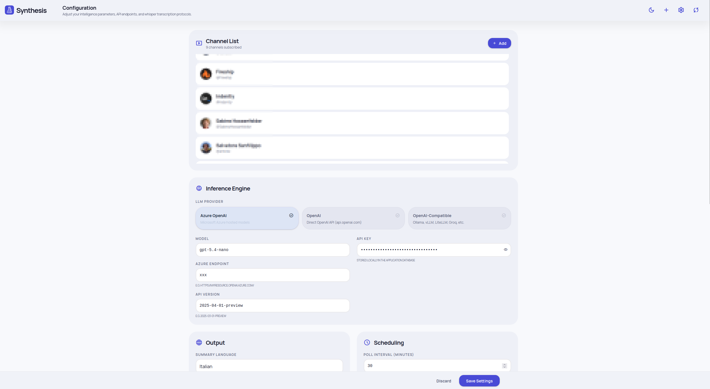
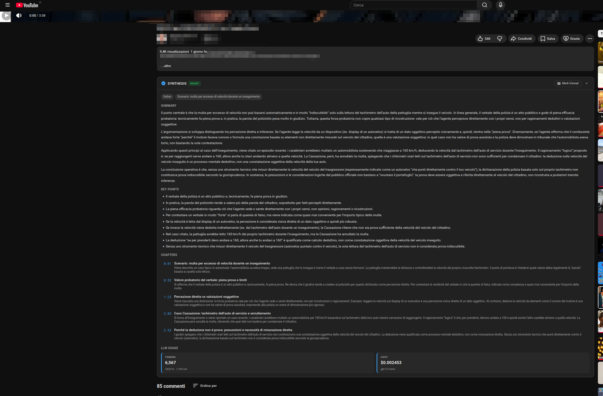
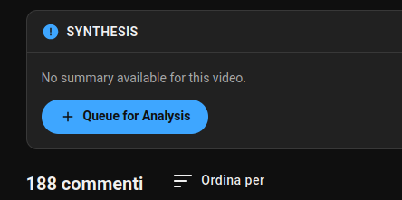
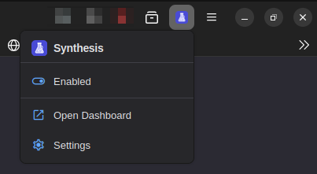

# Synthesis

**A self-hosted YouTube intelligence dashboard that automatically discovers, transcribes, and summarizes videos from your subscriptions using any OpenAI-compatible LLM.**

New videos are detected via RSS feed polling, subtitles are analyzed by the LLM of your choice, and the structured results — summaries, key points, and AI-generated chapters — are served through a web UI. The chapters are linked to the actual timestamps on YouTube. No video is downloaded.

A companion [browser extension](#browser-extension) for Chrome and Firefox brings the same summaries and chapters directly into YouTube watch pages.

> **Note on the frontend** — The frontend is built in plain vanilla JavaScript and Tailwind CSS. It was vibe-coded from the ground up by someone who genuinely hates frontend frameworks.

## Features

- **Multi-provider LLM support** — Azure OpenAI, OpenAI, or any OpenAI-compatible endpoint (Ollama, vLLM, Groq, and more)
- **Automatic video discovery** — RSS feed polling on a configurable interval
- **Structured summaries** — Each video gets a multi-paragraph summary, 6-10 key points, and auto-generated chapters with timestamps
- **Browser extension** — Chrome & Firefox extension injects summaries, chapters, and one-click queueing directly into YouTube
- **Whisper fallback** — When subtitles aren't available, optionally transcribe audio via the Whisper API
- **Cost tracking** — Token counts and estimated USD cost per summary, powered by a configurable model pricing table
- **Multi-language output** — Generate summaries in English, German, Italian, French, Spanish, Japanese, or Portuguese
- **Configurable tone** — Analytical, Creative, or Minimalist system prompts
- **Long transcript handling** — Automatic chunked map-reduce summarization for videos that exceed the context window
- **Database export/import** — Full SQLite backup and restore from the Settings page
- **Dark / Light theme** — Toggle in the header, persisted in localStorage
- **Single-container deployment** — Everything runs in one Docker container with a bind-mounted SQLite database

## Screenshots

<p align="center">
  
</p>
<p align="center"><em>The Feed — gallery grid with status badges, channel filter, cost tracking, and processing indicators.</em></p>

<p align="center">
  
</p>
<p align="center"><em>Video Detail — executive summary, key points, structured chapters with timestamps, and token/cost breakdown.</em></p>

<p align="center">
  
</p>
<p align="center"><em>Configuration — channel management, LLM provider selection, output language, and scheduling.</em></p>

<p align="center">
  
</p>
<p align="center"><em>Browser Extension — full summary, key points, chapters with clickable timestamps, and LLM usage stats injected directly into YouTube.</em></p>

<p align="center">
  
  &nbsp;&nbsp;
  
</p>
<p align="center"><em>Extension UI — "Queue for Analysis" prompt for unsummarized videos (left) and the toolbar popup with quick actions (right).</em></p>

## Quick Start

```bash
git clone https://github.com/ggerame/synthesis.git
cd synthesis
docker compose up -d
```

Open [http://localhost:8000](http://localhost:8000), go to **Settings**, pick your LLM provider, paste your API key, and you're done. No `.env` file needed — all configuration lives in the Settings page and is persisted in the database.

For headless or automated deployments, you can optionally pre-seed settings via a `.env` file (see `.env.example`).

## Configuration

All settings are managed through the **Settings page** in the UI. Environment variables are entirely optional — they only seed the database on first startup and are ignored afterwards.

| Variable | Default | Description |
|---|---|---|
| `LLM_PROVIDER` | `azure` | LLM backend: `azure`, `openai`, or `openai-compatible` |
| `AZURE_OPENAI_ENDPOINT` | — | Azure OpenAI resource endpoint URL |
| `AZURE_OPENAI_KEY` | — | API key (works for all providers) |
| `AZURE_OPENAI_MODEL` | `gpt-4.1` | Model deployment name |
| `POLL_INTERVAL_MINUTES` | `30` | How often to check RSS feeds (minutes) |
| `SUMMARY_LANGUAGE` | `English` | Language for generated summaries |
| `SYNTHESIS_DATA_DIR` | `/app/data` | Data directory (database + avatar cache) |

### Settings available in the UI

Beyond the env vars above, the Settings page exposes:

- **LLM provider tabs** (Azure OpenAI / OpenAI / OpenAI-compatible) with per-provider fields
- **API version** (Azure-specific)
- **System tone** (Analytical, Creative, Minimalist)
- **Max video age** — only process videos published within the last N days (default: 30)
- **Whisper fallback** — enable/disable, with its own provider, model, endpoint, and API key
- **Subtitle language** preference
- **Model pricing table** — add/edit/delete pricing rules for token cost estimation
- **Database export & import**

## Browser Extension

A companion **Manifest V3** extension for **Chrome** and **Firefox** that surfaces AI-generated summaries and chapters directly on YouTube watch pages. It connects to your Synthesis backend — no separate server needed.

| State | What the extension shows |
|---|---|
| **Summary ready** | Full summary, key-point bullets, clickable chapter timestamps that seek the player, LLM usage stats, and Mark Read / Unread. |
| **No summary** | A *"Queue for Analysis"* button that sends the video to Synthesis for processing. |
| **Processing** | A live progress indicator (queued → downloading → transcribing → summarizing) that polls until the summary is ready. |
| **Failed** | Error details and a one-click *Retry Analysis* button. |

The toolbar popup provides quick enable/disable, a dashboard link, and settings access. The extension options page replicates the full Synthesis settings panel (LLM provider, channels, output language, tone, Whisper fallback, model pricing, and more). The backend endpoint defaults to `http://localhost:8000` and is configurable.

### Try it

**Chrome** — Open `chrome://extensions`, enable **Developer mode**, click **Load unpacked**, and select the `browser-extension/` folder.

**Firefox** — Open `about:debugging#/runtime/this-firefox`, click **Load Temporary Add-on…**, and select `manifest.json`. 


### How the extension works

The **content script** runs on `www.youtube.com`, listens for YouTube's `yt-navigate-finish` SPA event, and injects the Synthesis panel below the video description. All network requests go through the **background service worker**, which holds the `host_permissions` for the configured backend. Chapter timestamps seek the `<video>` element directly — no page reload needed. Styles are scoped under `#synthesis-ext-root` and use YouTube's CSS custom properties (`--yt-spec-*`) to adapt to light/dark theme automatically.

## Local Development

```bash
cd synthesis
python -m venv .venv && source .venv/bin/activate
pip install -r requirements.txt
```

You'll also need `ffmpeg` and `yt-dlp` installed on your system.

```bash
export SYNTHESIS_DATA_DIR=./data
uvicorn backend.main:app --reload
```

> Tailwind CSS is compiled at Docker build time using the standalone CLI. During local dev, the existing `frontend/css/styles.css` is used as-is. If you modify Tailwind classes, rebuild with:
> ```bash
> npx tailwindcss -i frontend/css/input.css -o frontend/css/styles.css --watch
> ```

Open [http://localhost:8000](http://localhost:8000).

## Architecture

```
┌──────────────────────────────────────────────────┐
│                    Browser                       │
│   Vanilla JS SPA + Tailwind CSS                  │
│   Pages: Feed · Video Detail · Settings          │
└─────────────────────┬────────────────────────────┘
                      │ REST API
┌─────────────────────▼────────────────────────────┐
│               FastAPI (Uvicorn)                  │
│   Routers: videos · channels · settings · system │
│   Static files served at /                       │
├──────────────────────────────────────────────────┤
│            APScheduler (background)              │
│   RSS polling → subtitle download → LLM summary  │
├──────────────────────────────────────────────────┤
│   Services:                                      │
│   feed_poller · summarizer · subtitles ·         │
│   channel_resolver                               │
├──────────────────────────────────────────────────┤
│               SQLite (WAL mode)                  │
│   channels · videos · summaries · chapters ·     │
│   settings · model_pricing                       │
└──────────────────────────────────────────────────┘
```

Everything runs as a single process inside one Docker container. The SQLite database and avatar cache are persisted via a bind-mounted `./data` volume.

## API Reference

### Videos

| Method | Path | Description |
|---|---|---|
| `GET` | `/api/videos` | Paginated video list. Query: `status`, `channel_id`, `page`, `limit`, `sort`, `order` |
| `GET` | `/api/videos/{video_id}` | Full video detail with summary, chapters, and cost breakdown |
| `PATCH` | `/api/videos/{video_id}` | Mark read/unread (`{ "is_read": true }`) |
| `POST` | `/api/videos/summarize` | Submit a video URL for immediate summarization |
| `POST` | `/api/videos/{video_id}/retry` | Retry a failed video |
| `GET` | `/api/videos/{video_id}/delete-check` | Check if deletion will cause re-download |
| `DELETE` | `/api/videos/{video_id}` | Delete a video |

### Channels

| Method | Path | Description |
|---|---|---|
| `GET` | `/api/channels` | List all subscribed channels |
| `POST` | `/api/channels` | Add channel by `@handle`, `UC...` ID, or full YouTube URL |
| `GET` | `/api/channels/{channel_id}/avatar` | Serve cached channel avatar |
| `DELETE` | `/api/channels/{channel_id}` | Unsubscribe and delete all associated data |

### Settings

| Method | Path | Description |
|---|---|---|
| `GET` | `/api/settings` | Retrieve all settings |
| `PUT` | `/api/settings` | Update settings |
| `GET` | `/api/settings/pricing` | List model pricing rules |
| `POST` | `/api/settings/pricing` | Add or update a pricing rule |
| `DELETE` | `/api/settings/pricing/{id}` | Delete a pricing rule |
| `GET` | `/api/settings/export-db` | Download a SQLite database snapshot |
| `POST` | `/api/settings/import-db` | Upload and replace the database (creates `.bak` backup) |

### System

| Method | Path | Description |
|---|---|---|
| `GET` | `/api/health` | Health check (database + LLM connectivity) |
| `POST` | `/api/refresh` | Trigger immediate feed poll + summarization |

## Tech Stack

| Layer | Technology |
|---|---|
| Backend | Python 3.12, FastAPI, Uvicorn, APScheduler |
| LLM | OpenAI Python SDK (Azure, OpenAI, or compatible endpoints) |
| Transcription | yt-dlp, ffmpeg, Whisper API (optional) |
| Token counting | tiktoken |
| XML parsing | defusedxml |
| Frontend | Vanilla JavaScript, Tailwind CSS v3, Manrope font, Material Symbols icons |
| Browser extension | Manifest V3 (Chrome + Firefox), plain JS/CSS |
| Database | SQLite with WAL mode |
| Deployment | Docker (single container), docker compose |

## License

MIT
